<h1 style="text-align: center; font-size: 45px;">Engineering Notebook</h1>

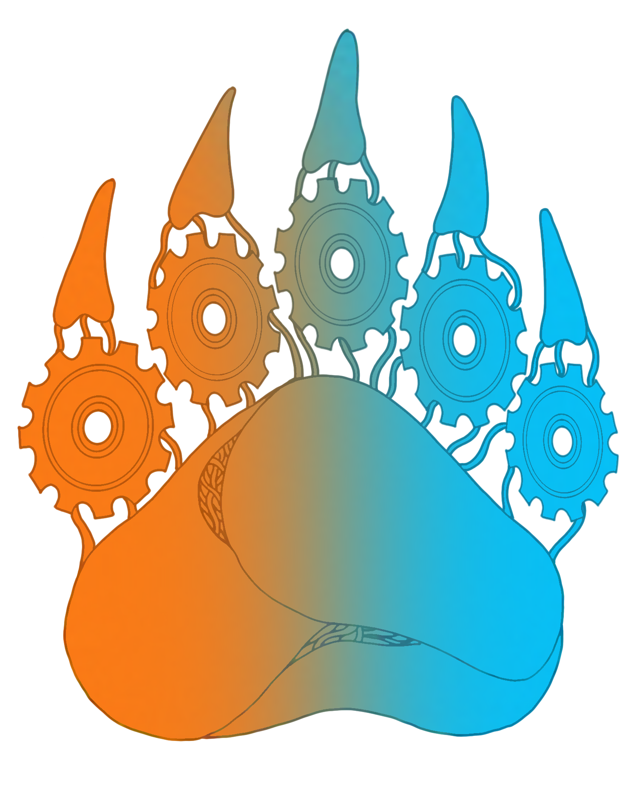

<h2 style="text-align: center; font-size: 30px">RobotIGS</h2>

&nbsp;

&nbsp;

## Summary

### Who we are:

We are 10 students mainly in 12th and 13th grade of the Georg-Christoph-Lichtenberg-Gesamtschule Göttingen (IGS). Our main goal besides building a robot is to spread the FIRST spirit and to inspire others for STEM.

### The origin/start of the team:

Our team was founded in 2016 after an american student exchange with the FIRST Robotics Competition-team "RoHAWKtics" from the Hardin Valley Academy inf Knoxville, Tennessee. During this three weeks in March 2016 the students had the opportunity to be part of a FRC team and observe their way of workinh on a robot for this bigger competitions. There they had been catched by their fascination for FIRST and STEM. They got inspired and became part of the community.

Back in Germany they soon founded there own FIRST Tech Challenge team and convinced the school to support robotics.

### Team Structure
To work as efficient as possible, we modelled our fields of activity after the american FRC team our predecessors worked with in 2016. We have a nominated team captain, a captain of the sofware department and a captain of the building department. These are pretty much just organizational positions, the team-captain and department-captains have to deal out tasks in their teams and in general. But they are neither higher in any command structure nor are their opinions worth more, except because of their larger experience. In addition, our mentors are always on an eye-level with the students and their words in discussions about the robot, the goals and the priorities count just as much.

&nbsp;

&nbsp;

## Table of Contents

1. [Building](##Building)
   1. [Mechanisms](###Mechanisms)
   2. [TeamObject](###TeamObject)
   3. [3D-Printing](###3D-Printing)
   4. [Documnetation](###Documentation)
2. [Coding](##Coding)
   1. [The control System](###The-control-system)
   2. [Autonomus](###Autonomus)
   3. [Signal-Sleeve Detection](###Signal-Sleeve-Detection)
   4. [Github](###Github)
   5. [Documentation](###Documentation)
3. [Team Information](##Team-Information)
   1. [Team Organisation](###Team-Organisation)
   2. [Sponsors](###Sponsors)
   3. [Team Mission](###Team-Mission)
   4. [Goals](###Goals)
   5. [Sustainability Plan](###Sustainability-Plan)
   6. [Business Plan](###Business-Plan)
   7. [Awards & Recognitions](###Awards-&-Recognitions)

&nbsp;

&nbsp;

## Building
### Mechanisms
#### Drivetrain
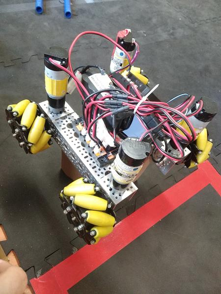
The drivetrain consists of three cross-ties structured like an H. On each side of the chassis are two mecanum wheels allowing the robot to drive in every diraction. The Robot is build in an H shaped form especially for stability, but also because the lift could then be placed right into the middle. The plan designing the chassis was to make it as small as possible so that the Robot would drive more easily between the different junctions. The four 223 RPM motors are placed on each end of the chassis with an angle of 90 degrees to the mecanum weels. They are connected to the wheel with gears. On the back of the robot is the control hub and one expansion hub. The battery is placed below the hubs. The rear motors are secured by some U-Channels. The allience-marker are placed on top of the protection. The hubs are enclosed with a plate to ensure their safety.

#### Lift Mechanism
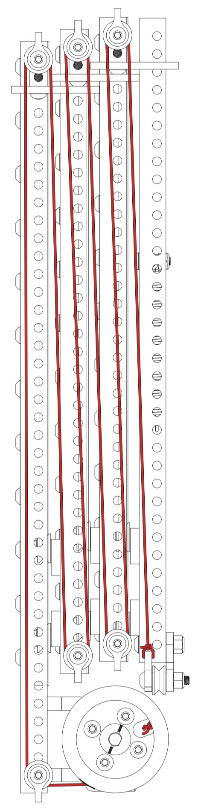
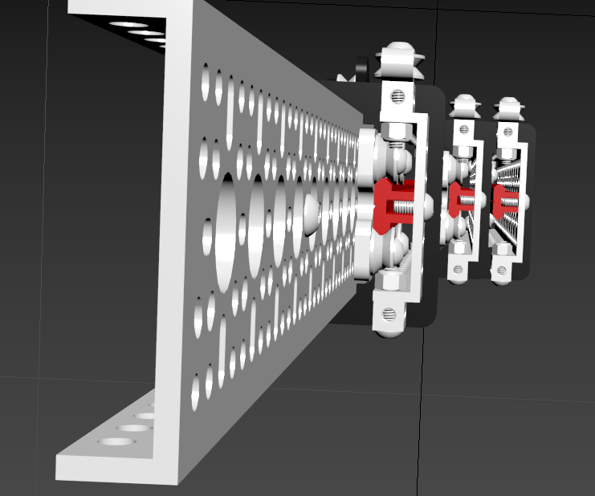
In the center of the robot is the most important be able to score points in this season. The lift consists of five bars. They are connected to each other by four rails (red), allowing the Lift to be extended using one 117 RPM Motor. At the bottom of the last bar is the claw with his lift attached. The motor is connected with a rope that runs over several points and is connected to a spring on the last bar. It is one of many options, we considered and by far the simplest. The rope is pulled by the engine onto a self designed whinch. The tower expands upwards and brings the cup on the right hight. The hight of the tower depents on how much rope is rolled up onto the whinch. However if the motor keeps on pulling the rope, even if the tower is on the maximal hight, the rope will eventually tear and this would make the whole lifting mechanism useless. The countermeasure to this problem is to attache the end of the rope to a spring, wich would take the most of the excessive force from the motor by extending.

#### Claw
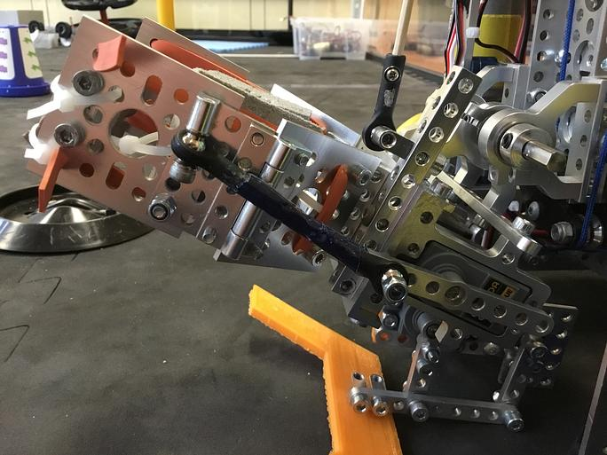
The claw mechanism is fairly one of the most complex things build in the robot. First of all, it’s located at the lower end of the lift. It consists of 2 servos, which can close and open the claw by rotating. When it rotates forward it will drive a ball joint forward which presses on the claw to close it. When rotated backwards it will draw the ball joint backwards and pulls the claw open. 
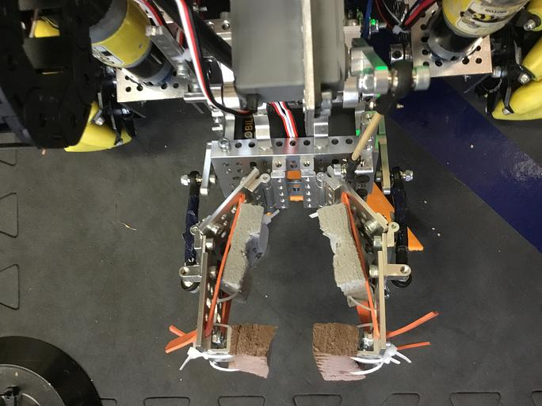
The claw consists of two mutually 120 degrees angles. They have a particularly friction capable material strapped on, this should prevent the cone from falling down.

#### Claw Lift
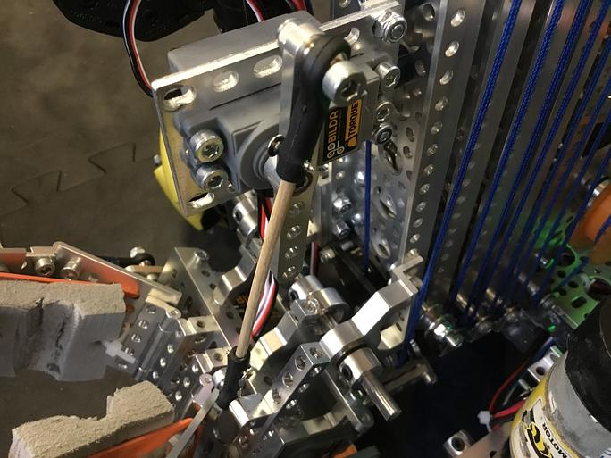
The claw was expanded with a lifting mechanism. It’s used to tilt the claw upwards so the cone doesn’t touch the ground junctions while driving. In addition, it helps to aim for the junctions when the robot is driver-controlled or during the  autonomous-phase.
To lift the claw, a servo is build above it onto the lift. The rotation of the servo is converted into a up-and-down-movement with a wooden stick. The stick is attached to the claw which is able to tilt due to it attachment to a axis

#### Camera Attachment
To fullfill the curent challenge, especially to recognice the Signal Sleeve template during the autonomous phase, a camera is mandatory. Because the robot doesn't use the given navigation images to navigate around the playing field, the camera doesn't have to "see" the whole field. This aspect helps a lot on finding a good spot to attach the camera onto the robot.
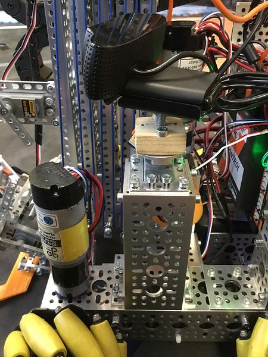

After evaluate diffrent possible spots, the decision fell to attach the camera on the left hand side of the robot chasis. From this location, the camera is able to catch everything happening before the robot. Futhermore, it's one the only spots to attach the camera safely and without increasing the length or width of the robot. The attachment was build of a 4-hole U-Channel, which is attached vertical onto the Chassis. On to of the U-Channel, a servo was mounted. He turns the camera around the vertical axis if necessary. The size of the attaching-thread on the camera brougth up some problems: The screw needed to attach the camera was not compatible with all other screws and threads used to build the robot.

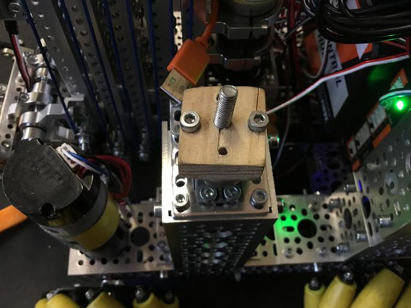

After some brainstorming, the decision fell on a small piece of wood as a connection piece. A screw with the corect size to connect with the camera-thread was put in the center of the wood after a goodsized hole was drilled. Two more holes were drilled left and right of the center. Those are used to attacht the piece of wood onto the servo. This camera attachment fullfills all requirements.
### 3D-Printing
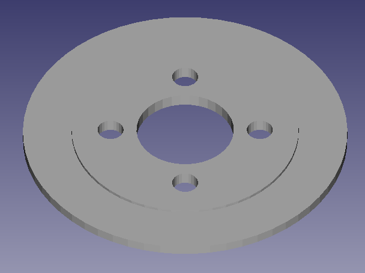
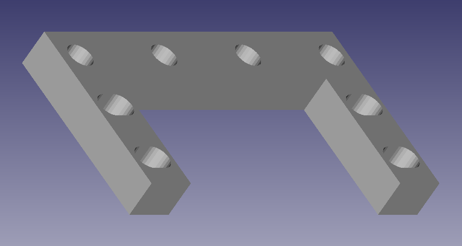
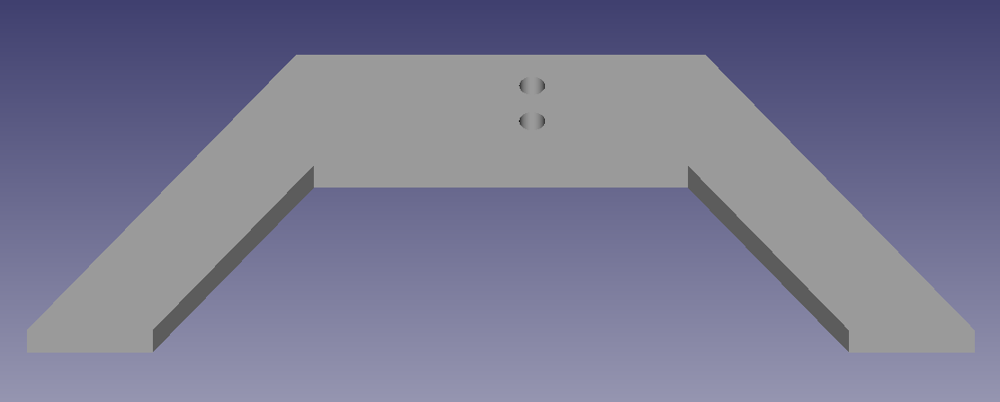
To make extra parts we use a small 3D printer. The design of the parts is done by us, using FreeCAD. This is a free alternative to Solidworks, which we have now abandoned, since we have switched completely to free and open source software. Among other things, we have installed archlinux on all RobotIGS laptops, so that we are no longer dependent on windows.

### Team Object
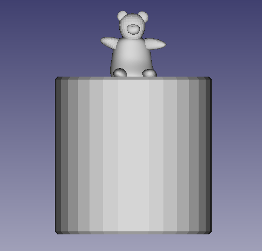
The thought behind the idea of the design of our Teamobject had its origin with our Team mascot, a teddy bear. On top of the cylindric shape you can find the miniature bear, which is symbolic for the mascot. We chose the shape of a cylinder, due to it being a good performing shape, when it comes to a practicable transportation by the Robot and security while being staked on the pole. Blender and FreeCad had been our choice of 3D designing programs. They have a great compatibility and complete each other with their features perfectly. The process started by designing an object similar to a cup (the cylindric shape) and a little bear. The biggest problem occured while printing and adjusting sizes of the different shaped objects. We weren’t able to print the bear and cylinder together, due to its missing stability in the center area. The design of the cylinder started easily by adding a cylinder an subtracing another smaller one from the bigger one, to create a cavity. The more difficult part had been designing the bear, which we achieved by adding deformed ball shapes to eachother to create the look of a stuffed animal. Both of them where added to each other and printed in our 3D printer.

&nbsp;

&nbsp;

### Documentation
**15/09/2022**
We dissasembled the upper parts of our robot. Only the drivetrain staid, because we really liked the small and compact design of it. This will also be very helpful in this season, because of the small space between the different junctions.

**20/09/2022**
Today we started to build the lifting system. Our main worries are the stability of such a small drivetrain with the high and heavy lift in its middle. Another problem were the small space between the two side bars of the drivetrain, in which only a cone but nothing else fits.

**22/09/2022**
We expanded the drivetrains bars to the sides by a few inches to have more space between them and to give the robot more stability. 
A spring and a thicker rope were added to the lift to make the lift to prevent failures, damages on the motor and to make the lift smoother in general.

**27/09/2022**
Today we made a FMEA-table to compare two ideas out of the categories number of lifting arms, size of drivetrain and intake. The intake ideas were to use hole in the cones to grab it or to grab the cones from the side. We rated the ideas in five categories from 1 to 10. The result were to use only one arm, a small drivetrain and a sidewise intake.

Category|1 Arm| 2 Arms| Small Drivetrain | Large Drivetrain | Intake Above | Intake Side|
|----|----|----|----|----|----|----|
Building Time | 1 | 4 | 1 | 2 | 6 | 5 |
Complexity | 3 | 1 | 2 | 3 | 5 | 4 |
Weight | 5 | 4 | 2 | 3 | 3 | 1 |
Prone to Errors | 4 | 7 | 5 | 4 | 2 | 1 |
Speed | 3 | 5 | 3 | 4 | 2 | 4 |
Total | **16** | 27 | **13** | 16 | 18 | **15**|

**29/09/2022**
Theodor designed the winch we want to use for the lift in OpenCAD. To ensure the design has the right size we printed it in a bad quality.
The motors are now held in place by four screws.

**04/10/2022**
We printed the whinch.
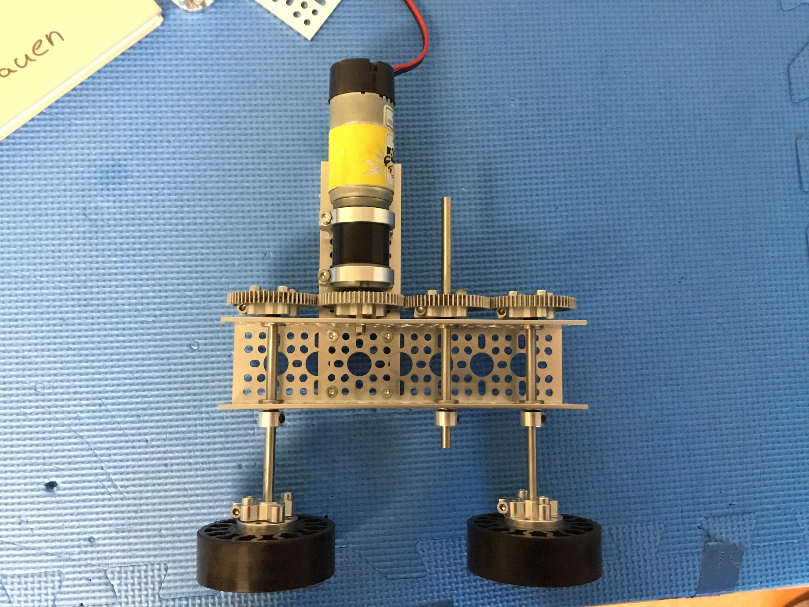 We have designed the first prototype of the intake system. It consists out of two rubber wheels and one motor. The wheels rotate in diferent directions to be able to suck the cone in.
The drivetrain was conected to the control-hub in order to test it. A bracket for the control-hub and expansion-hub was added.

**06/10/2022**
The whinch was edited and printed again. We added the whinch but realised it was to small to fit all the rope in.
We thought about different intake systems, because the first prototype seems to be pretty bad. Another problem was to reach the highest junction with our lift system to achieve the maximal points of five for every cone.

**11/10/2022**
Today we improved the whinch in order to roll up the rope correctly.
We started to think about a gripper system with two servo motors. Therefore we tested the lift with weights. The lifting-motor was changed from a 30 RPM to a 117 RPM motor to make the lift faster. The weight the 117 RPM motor could lift was enough.

**13/10/2022**
We noticed that some servo motors needed a really long time to initialize. All servos were tested. Only three are working correctly. The servos used in the gripper prototype, named claw, were changed.
The claw prototype was finished and attached to the lift. A problem we noticed was the really long way the cables had to run down.

**01/11/2022**
Today we tested the claw.

**03/11/2022**
The playing field came.

**08/11/2022**
We cleaned up and restructured our room.

**10/11/2022**
Today we attached sticky rubber band to the claw to give it more grip.
Cables were tied together.
We noticed that our lift is 3cm to short in order to score onto the highest junction.

**19/11/2022**
We thought about a way to overcome the 3cm. Two ideas were adding another bar to the lift and to turn up the claw. We decided to build the first one. We added another servo to  the lift which could turn up and down the claw attached to an axis.
In order to connect the servos to the hub we attached a tow chain to our robot. The tow chain is able to fold.

**22/11/2022**
Today we tested every servo used by the robot. We drove the robot with lift and claw for the first time.
A securing was added to the lift. If something goes wrong the motor won't be damaged.

**24/11/2022**
Preparation for the scrimmage in Stuttgart. Pull tight screws on the wheels. Cables were tied together. The cable port were checked because the matrix code wasn't working. Nothing changed.

**01/12/2022**
We switched motors in order to make the matrix working. 
We changed to foam and latex as the material for the claw grip. The camera was added.

**06/12/2022**
Today we changed to smaller fome pieces because the cone had been sliding out of the claw.
We sorted our priorities. 

**13/12/2022**
The akku was moved further to the front.

**15/12/2022**
We fixed a loose ground junction.

**20/12/2022**
We went to the christmas market for teambuilding measures.

**10/01/2023**
After the holydays, we started with new entusiasm. During the testing, the softwareteam mentioned the need of a mechanism to center the junction in the autonomous phase. So the mindstorming began. 

**12/01/2023**
We realized a new cable management was needed, so nearly all cables were bound in a new, more efficiant way. 
Additionally, the mindstroming for the junction centering mechanism was continued.

**17/01/2023**
Today we designed our Team Object. The decision fell on a half open cylinder with a small bear, our mascot, on top of it.

**19/01/2023**
The first team object was printed. After it was finished, we painted it red.
Furthermore, we 

**24/01/2023**
junction centering desinged by prototype made out of catoon and printed

**25/01/2023**
junction centering mechanism

**26/01/2023**
The seccion began with the printing of the second team object and two small bears. After the team object was finished, it was painted in blue. 
Another task done today was the fixing of the front montors. Some of the screws were loose, which resulted in some problems during testing.

&nbsp;

&nbsp;

## Coding

### Driver Controls
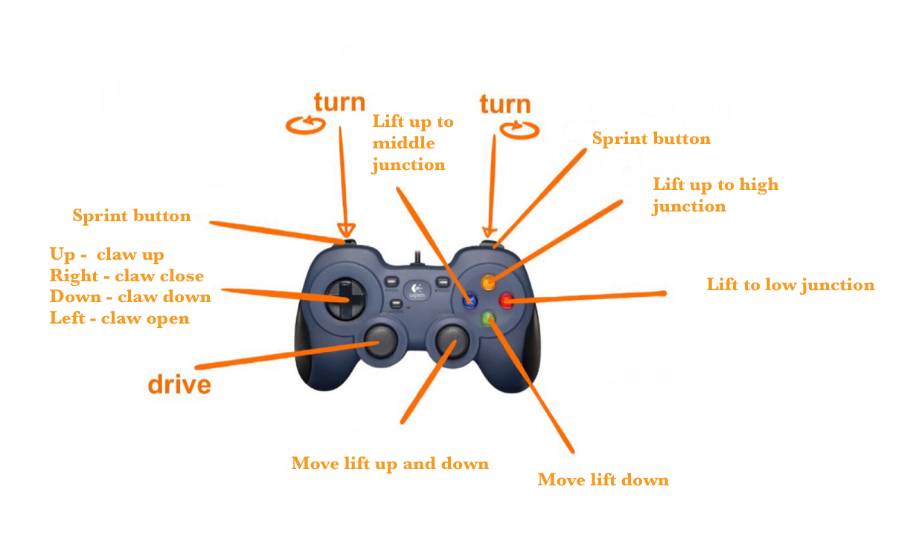
### The control system
We use inverse kinematics to calculate the coordinates of the robot based on the movement of the motors. This allows us to drive by coordinates on the field, which is more accurate than driving by time. To make this easier for new members, the software captain has written aclass that handles the logic behind it, making it easier to get started and understand the code more easily.

### Autonomus

#### Goal

The goal is, during the autonomous driving time, to put a cone onto the high junction and park it first either in the terminal or in one of the parking zones. This is to be done in a quadrant-specific manner so that the robot follows the correct paths depending on its starting position. 

#### Procedure

At the beginning, the cone placed in the claw is gripped and the arm is raised a little, so that the robot is not hindered by the claw being placed on it. The robot moves forward a little to be able to recognize the pattern on the signal, whereby the parking zone is passed. First, the robot moves to the straight line where the highjunction is located. Due to driving inaccuracies and the added weights, the program specifies that it should drive 8cm further than necessary to be on the straight line. To ensure the alignment, frontal to the straight line, the robot moves backwards against the wall. Now it drives straight towards the highjuntion, raising the arm to the necessary height. Shortly before the arm is above the junction, the speed is reduced, which guarantees a safe lifting of the cone. Now the robot moves, depending on whether it could recognize the pattern on the signal, into the assigned parking zone or into the terminal.

### Signal-Sleeve Detection
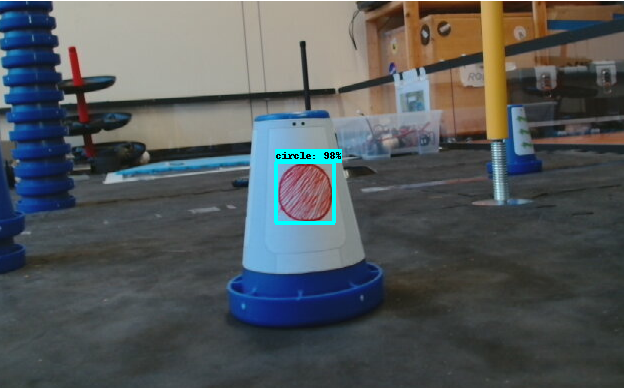
In order to recognize the signals, we have trained an AI in the form of an SSD network, which can recognize our self-designed signal sleeve. As soon as the camera has recognized the signal with a certain accuracy, the robot continues the autonomous. If it does not recognize the signal in a given time, it will be parked in the terminal instead of the displayed zone at the end.

### Github
To use Github we use the application Gitkraken to make it easier for new members since the season Relic Recovery 2017/18. We use Github to give everyone access to the recent updated part of our code. So, all four core members of software can always work from their separated computer and in the end upload it. This is especially important, as we need to work parallel. Github has a lot of useful tools to communicate within the
application, for example to describe the made changed in the code to easily find the version of code we need.
Within one repository of code there are several branches, which are useful to work on different stages of player controlled and autonomous at the same time, while having a working code just in case. This season we used several so-called “branches” for our player controlled, for our tests with Vuforia, for our tests with the gyro and for several other testing things as for example the tests-tools for the building section of our team, to test individual motors and servos. To get up-to-date with the code is easy made with the pull button, to upload the code is more complicated. Before pushing the code, we can stage all changes we made or we can stage individual change we want to upload.

&nbsp;

&nbsp;

### Documentation
Since kickoff: 

We started the season with training our new members how to work with the software we are using and how to getting started. 

**09/29/2022**
Today we updated our code structure. We created a new Git repository for the new season. 

**10/04/2022**
Today we updated  the Robot controller and Driver station firmware to version 8.0 . We also adjust our FullControll code which allowed us to manually control the whole Robot. At the end we testest some Motors of their functionality.

**10/06/2022**
Today we updated the firmware of our phones and hubs and where setting them up to having an a and b set phone and control hub  to working together. The rest work up as backup in the case that both control hubs have failed. We have tried to find a bug in our field navigation system which made driving impossible and we created a motor test program for the building team so they can test the motors. 

1**0/11/2022 **
Today we created the servo test program. Have fixed the matrix in our field navigation program trying to fix the driving problem. We also are adding new branches for the autonomous and the FullControll and updated the software of our laptops. 

**10/13/2022**
Today we wrote field navigation testing program and were able to another big in our matrices where the x position where inversed. 
We also fixed the position part in the field navigation matrix to correspond with the changes of the dring part in the matrix last session. In the end we where investigating a problem with our servos where the servos where taking minutes to initialize. 

**11/01/2022**
Today we started with writing code for our base autonomous. In the field navigation class we fixed a bug with the gyro rotation where a rotation value wasn’t normalised. We also decided that we won’t fix the issue with the inversed  x coordinate. In the end we created a  test program for the claw but we’re able to make it work as wanted because the session endet. 

**11/03/2022**
Today we got our playing field and assembled it. After that we completed the servo test program for our claw and created a testing branch where we have started to write code for the lift. In the end we got an error where the robot controller weren’t able to find the calibration file for the gyro. 

**11/08/2022**
Today we fixed the error with the missing calibration file for the gyro. Also we updated our laptop software. 

1**1/10/2022 **
Today we fixed an issue with the field navigation class where the robot had motor speed out of range. We also made the base autonomous able to drive to specified positions. 

**11/15/2022**
Today we created the simple autonomous and made fixes to the base autonomous. We also created a new method in the field navigation class to allow the robot to rotate to a specified rotation. In the end we updated our laptop software and we identified another issue with the field navigation matrix but we had no time left to investigate further. 

**01/22/2022**
Today we fixed values in the FullControll to make driving smoother. And we investigated the issue with matrix. 

**01/24/2022**
Today we continued the investigation of the matrix and made value changes in FullControll. 
And we updated the laptops because we forget it the last session. 

**12/01/2022**
Today we started refactoring of the field navigation class. 

**12/06/2022**
Today we created a schedule for the next sessions before the scrimmage in Stuttgart. Afterwards we work on the field navigation class. 

**12/08/2022**
Today we wrote a method for driving to the high junction in our base autonomous and cleaned up our git repository by merging some branches. 

**12/13/2022**
Today we working at the full autonomous and started at the signal detection utilizing Vuforia and tensor flow lite. Also we designed our custom signal sleeve. In the end we updated our laptops software. 

**01/10/2023**
Today we updated our laptops and tested the signal detection. We also have written a method for parking in the right zone which a indicated by the signal and we have merged code in the autonomous branch. 

**01/12/2023**
Today we worked on the parking zone method.

**01/17/2023**
Today we created a dataset for training the custom object detection model to detect our signal sleeve. In the end we updated our laptops software. 

**01/19/2023**
Today we wrote code for the junction centering mechanism. 

**01/24/2023**
Today we tried to optimise our full autonomous  and we fixed issues junction centering mechanism. 

**01/25/2023**
Today we used free hours to work on the autonomous. 

**01/26/2023**
Today we almost completed the autonomous.

&nbsp;

&nbsp;

## Team Information

### Team Organisation
The most outstanding fact about our team is that we are mainly organized by the students. In this case and connected to our school’s philosophy the two teachers are on the same level as the students. Our team captain Justin is moderating our discussions in the beginning of every meeting. The building and software captains Marius and Theodor take care of assigning tasks and communication between the parts of our team.
The separate tasks are something we adopted from the american team RoHAWKtics at our first school exchange in march 2016. We have the two departments Software and Engineering within our team structure, with each an captain and each different students taking part in it.
To use our team structure properly, to assign tasks and share documents we use the application Basecamp, which is often used by companies to organize themselves and is therefore perfect for our team organization. In the main part we have several “teams”, each for one part of tasks. The Software team mainly for writing down ideas and for sharing different documents. The Building team uses Basecamp nearly the same way by sharing files for 3D printing, documents, ideas etc.
Mainly the team-captain with the help of our teachers and different team-members takes care about our budget, sponsors and about our trips to competitions. In the Outreach team all texts and files for the Engineering Notebook are concluded and the plans for events get developed. Another useful tool from Basecamp are Projects we assign for upcoming events, like the Scrimmage at Stuttgart or the Competition in Kaiserslautern. Also we post there timelines of the days of trips or general information like dates or reminders to bring several items.

Within every team and every project there are five categories. The Campfire, which is a group chat for all people within the team. The Message Board, where Messages and Announcements can be made. Docs & Files where documents can be uploaded, commented and shared. To-dos which can be assigned and a schedule to make assignments.

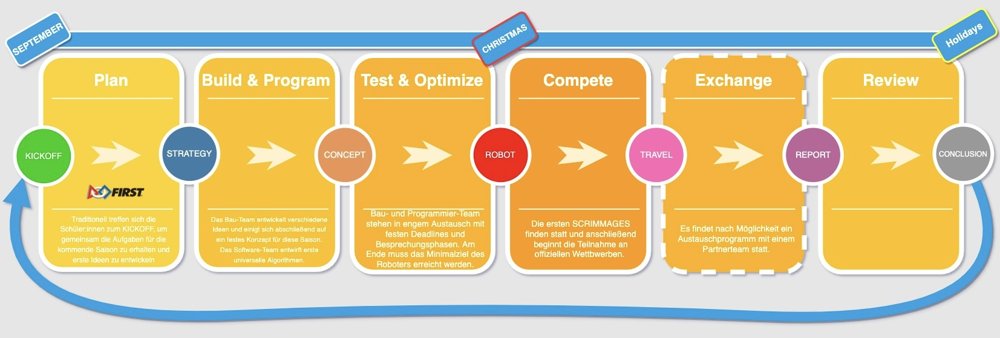

&nbsp;

&nbsp;

### Sponsors

#### Novelis
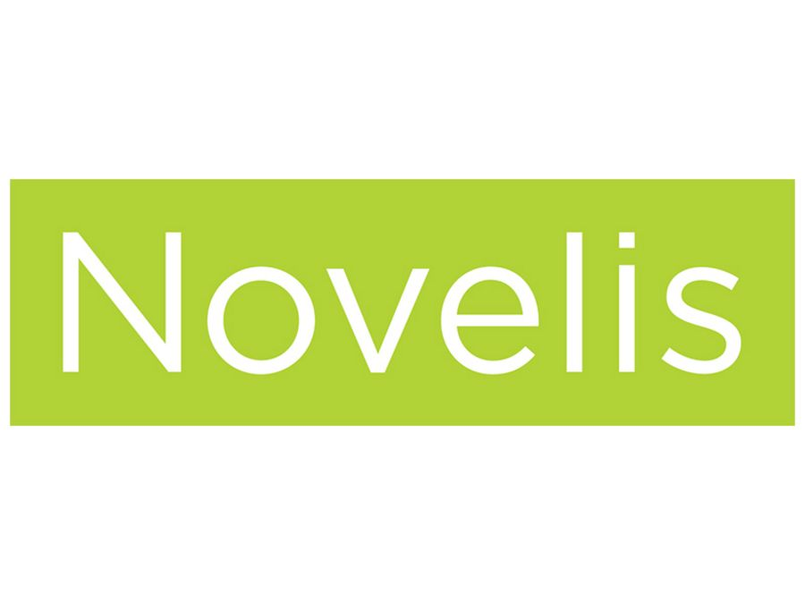
Novelis a special sponsor of our team. Since our first year they have donated multiple times money to us but also supported us with some expert reports from their trainees and the teacher of their trainees. Last year they became our longterm partner which means we are now getting yearly support from them.

#### Georg-Christoph-Lichtenberg Gesamtschule and friends’ association “Pro Gesamtschule”**
The IGS and their friends’ association supports our trips generously.

### Team Plan

#### Team Mission

Our mission as a team is not only to build a good robot and to create a safe place for some nerds - also we want to make FIRST better known in Germany and Europe. FIRST and FTC is not very popular here, with the exception of FLL. Since we learned what FIRST is all about in Knoxville, we think that we should show as many people as possible how great FIRST is and what it means to be part of such a great and worldwide community of children and young adults. FIRST is not just about STEM and science but also about taking the progress one step further and clear the way for the new generation of scientists and engineers. We want to inspire more girls for STEM areas and we want to show everyone that science isn't either an adult, nor just a man-thing but something everyone can be part of. FTC created so many unique opportunities which helped us to grow as persons. To give these opportunities to more people we try to inform and inspire as many people as possible.

#### Goals

##### Short term

We want to achieve a good result at an official Competition. That means to be in the upper half of the qualification rankings. In addition, we try to win at least one other Award.
We want to secure the future of our Team for next season. This year some members of our team graduate and we need to hand our knowledge over to the next generation so that it is possible for them to have a successful next season.

##### Medium term

We want to help other schools in setting up their own FTC Teams so that students there can experience what FIRST is about. To achieve that we try to do as much outreach as possible.
We want to host an official Competition at our school.
We want to advance to the World Championships.

##### Long term

We want to help FTC to build up a deeper competition structure in Europe with different Competitions within Germany.

##### Outreach Goals

With our outreach work, we want to achieve a couple of goals, but they all have in common that we want to spread FIRST and inspire as many people as possible. There are two main Areas of outreach work. On the one hand, we do RobotIGS specific work and general FIRST and FTC outreach.
For our team, we try to address potential Sponsors, so that we could continue our work. For that we talk to local companies directly, give presentations when companies visit our school and talk to potential sponsors at events we are visiting, like the Ideen Expo. We also try to find new students for our Team in our school. To accomplish that we present FTC and RobotIGS to different classes.
Our General FTC and FIRST outreach work have the goal to make FIRST better known in Germany. We talk to media agents and journalists as often as possible and present our robot to school intern events and local politics to gain more attention. Some of our graduated students also could help other cities' schools found and build up their own teams or become volunteers for other FIRST projects. Maybe someday they will be judges, parents or sponsors by themselves.

##### Integration in our School Schedule

We get a lot of support from our school to make FTC possible and more convenient for us as students. The school offers us a room and the friends' association of the school supports as financially a robot. We get the opportunity to leave the school for meetings or important events like competitions or a press conference.
What really helps us is the integration in parts of our school classes. Such as being part of the software department in 11th grade counts as a computer science class. Also, our project class in 12th and 13th grade can be done within RobotIGS. In both cases that means there is the opportunity to write our turn papers to a robotics related topic and spend the class at our room to work on team projects. This gives us the huge opportunity to portion our time to work by ourselves and become more self-reliant.
For instance, three of our students wrote their turn papers in their past school year about Blockchain in a Finance system and Building a Spider Roboter with building blocks.
In addition, a lot of teachers react understandingly for the sporadic miss of lessons and in case of a competition or event we have to go to all attending students get an excuse by the coaching teachers. For us this is relieving because we don't have to worry about our grades or teachers while we are on a competition or while we are working on the last parts of the robot.

#### Sustainability Plan

##### The future of RobotIGS

This Summer will be a defining one for our Team. Three of our core members will graduate and leave the school. This has set us up to big challenges, but the first steps were made to secure the future of RobotIGS. To get more concrete we take a closer look at the single sub-teams.

**Building:** Marius and Leon are  leaving us this summer but with Paul and Jesko, we have two very talented representatives from the younger generation. This season Paul got introduced to how we work and what you need to look out for when constructing a robot. We tried to give them as much learning by doing experience as possible and we are confident that they will do a great job next season on their own.

**Software:** Justin  will leave us in summer and a lot will stay in the team. The team themselves explained there teaching process in a separate text in the software section.

**Management:** Our Team-Captain will leave this year because he graduate, so we need to choose a new Team-Captain for the next Year. He has organised a lot for the team, like trips or public events, together with the Teachers Jonas and Martin. And also he take care of the financials of the team. 

##### Finding new Team Members

To find new members we are doing different outreach activities in our school. We show the robot, we are giving presentations in classes and hanging posters around the school. As a special way, we are mentoring a LEGO team. The young students there can switch to us if they visit the 9th class. Jesko did exactly that way, one year Lego than one year FTC building team. During the Fresentations, we try to show how diverse FTC is and that everybody can find their place if they try. From building up to designing and programming to event management,
One of our goals is always to also inspire girls for FTC, therefore we held a special Giris only first meeting where they could get a better impression of FIRST and FTC.
Once the students have found their way to us, we try to integrate them as best as we can. We all learned the most by just doing and trying so we try to give them as many opportunities as possible to work on their own, but we are always there to give assistant or answer questions. There are no advantages for anybody when they do the same mistakes as we did so we try to help them and assisting with the knowledge we gained in the proses.

When we are partnering with companies like Novelis we also try to get assistance from them directly. Most companies are interested in cooperation with their apprenticeship department. We are really grateful for the assistance we get from young engineers from Novelis. It's a point that we bring up always when we are looking for new partners.

### Business Plan

Date|Description|Income|Expenditure
----|----|----|----|
11/2022|Novelis|1.500€|0,00€
12/2022|Special Price Robotics|700€|0,00€
13/10/2022|Andy Mark Order|0,00€|461,88€
03/11/2022|Towchain (cables)|0,00€|16,99€
11/12/2022|3D Printer|0,00€|700€ 
Total||2200€|1.178,87€
Carry over for next Season||1.021,13€

### Strategic Plan

#### Awards & Recognitions

##### Jugend forscht, 2017
At a large MINT Competition we won the 3rd prize in the Category
Engineering. We presented our Robot and the mechanisms to a jury.

##### Connect Award, Stuttgart 2018
We got this Award for our extraordinary Outreach work.
We try to inspire as many people as possible and visited 
different Events to do so. Also our
Connections to local companies was awarded.

##### Finalist Alliance Award, Stuttgart 2018
We were selected as an alliance Partner. Together
with our partner we were a very well balanced alliance.

##### Jugend forscht, 2018
This year we participated with our building and software team,
which resulted in a 2nd Prize in Programming and a
3rd Prize in engineering. 

##### In collaboration with ISHR Mechanical Mustangs
two of our students won the
Albert Einstein Award for FIRST Global
International Excellence in Dubai 2019.

##### Control Award, Kaiserslautern 2020
We got the award for using our code and sensors
innovative to enhance the behavior of our robot
autonomous and player controlled.

##### Winning alliance Award, Kaiserslautern 2020
We won the competition along in an alliance with the
teams Highland Lynxes and Dead Banana One.

